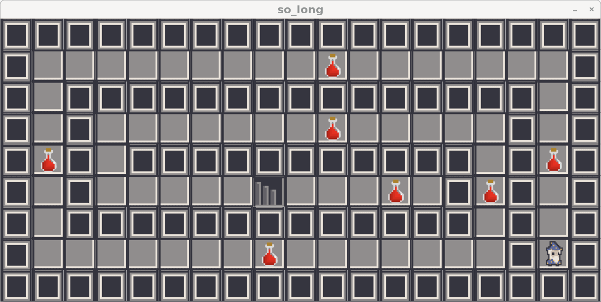

# so_long
topdown basic game demo \
move around to grab all the collectables go to the exit \
uses MLX42 https://github.com/codam-coding-college/MLX42 for window and texture management \
which is made by fellow codam student and based on https://github.com/glfw/glfw \
The full guidelines for the project can be found in `en.subject.pdf`. \
after each move, the total amount of moves done is printed to stdout

## Usage
choose a map from the maps directory \
make
```bash
./so_long maps/map_of_your_choice.ber
```
exit the game with `esc`, `ctrl-c in the terminal` or by reaching the exit

## Screenshots of the game
./so_long maps/test.ber \
11111 \
110E1 \
10001 \
1P0C1 \
11111 \


./so_long maps/pillars.ber \
1111111111111111111 \
10C0000000000000001 \
1010101010101010101 \
10000000000C0000001 \
1010101010101010101 \
1000P00000C00000001 \
1010101010101010101 \
10000000000E000C001 \
1010101010101010101 \
1000C00000000000001 \
1111111111111111111 \


./so_long maps/snakemaze.ber \
1111111111111111111 \
1000000000C00000001 \
1011111111111111101 \
1010000000C00000101 \
1C101111111111101C1 \
10100000E000C01C101 \
1011111111111110101 \
10000000C00000001P1 \
1111111111111111111 \

